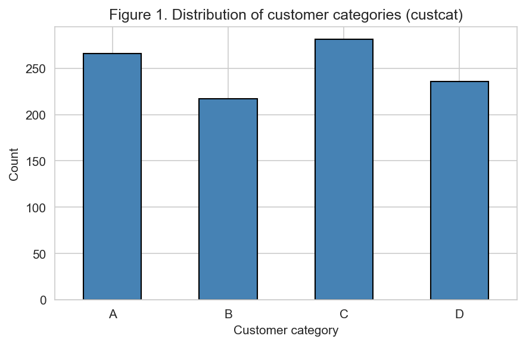
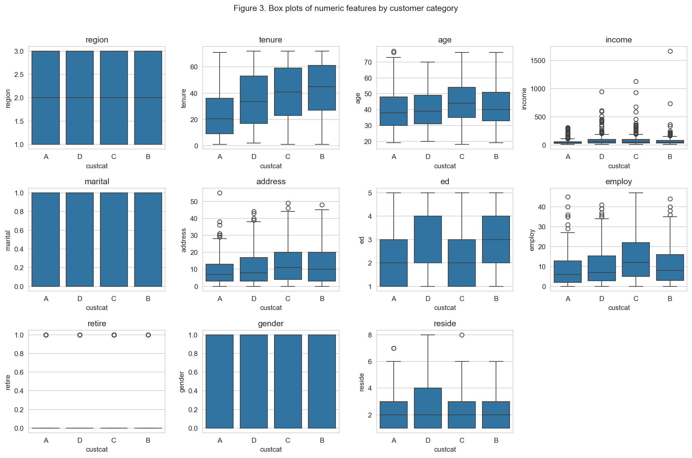
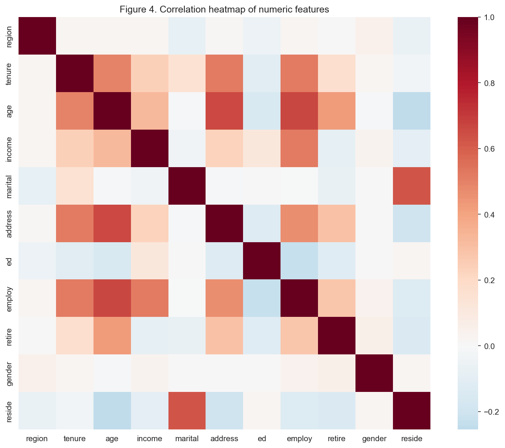
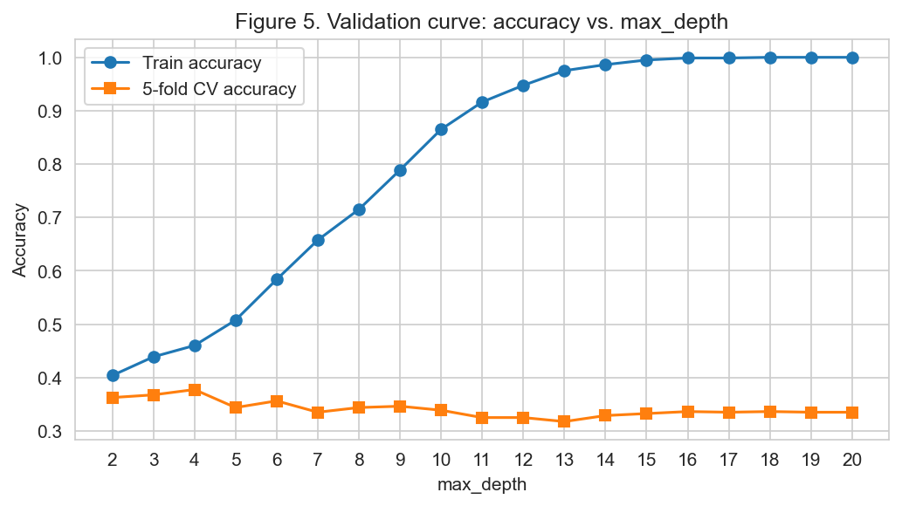
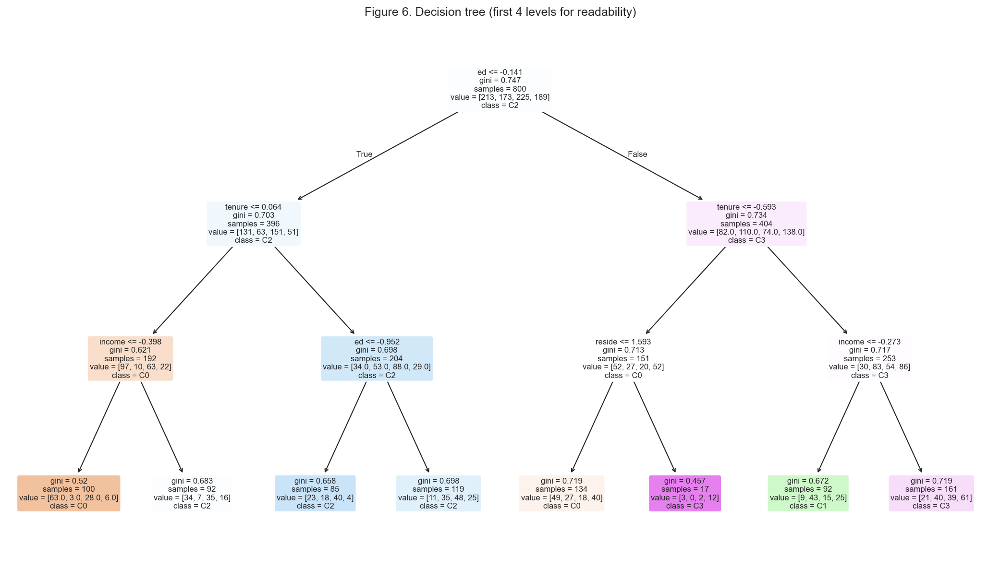
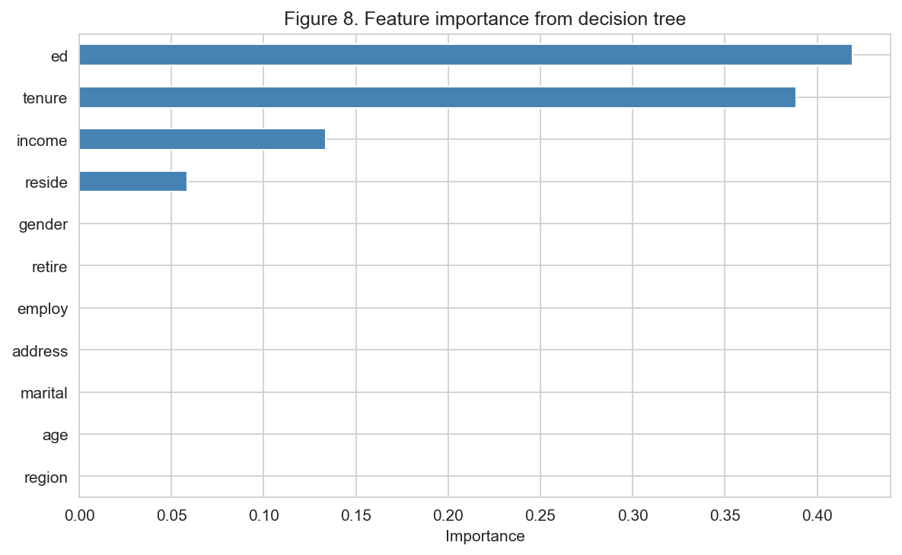
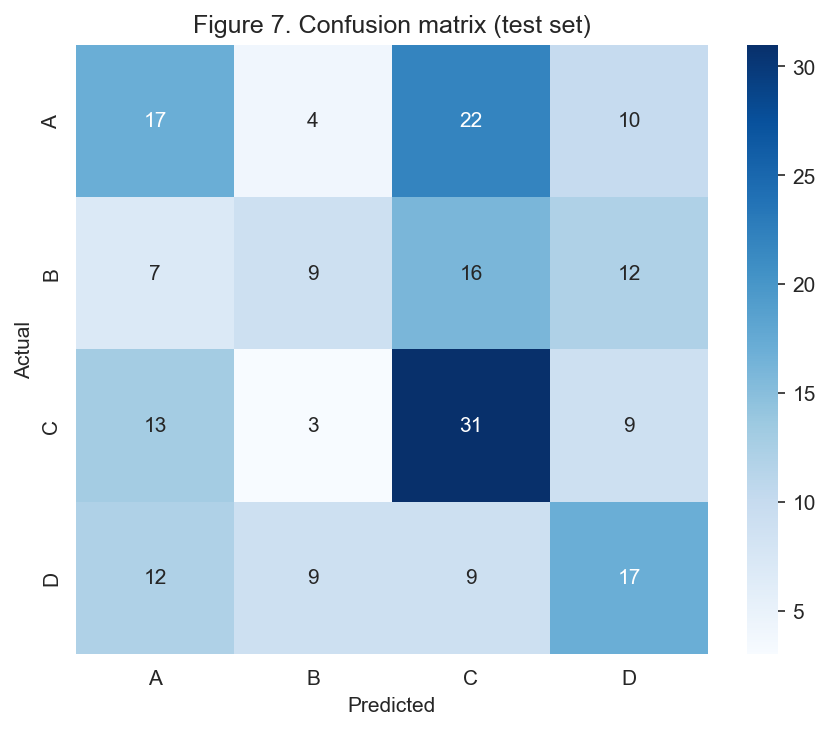
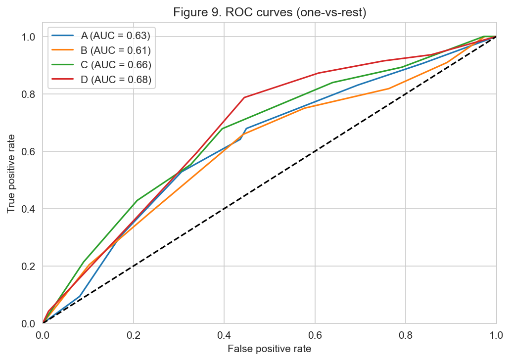

# Customer Segmentation with Decision Trees

## The Problem

Telecom companies manage millions of customers across different service tiers, but they rarely know *why* a customer belongs to a particular segment. Without that understanding, marketing campaigns are generic, support resources are misallocated, and churn prevention is reactive instead of targeted.

**The core question:** Given only demographic and account-level data, can we classify customers into their correct service tier — and more importantly, can we understand *what drives* that classification?

## Why Decision Trees?

The first priority is understanding *what drives* segmentation, not just predicting it. Decision trees were chosen because they produce human-readable rules — "if education > 3 and tenure > 40, classify as segment C" — and rank features by how much they contribute to the classification. That directly answers the business question. They also handle mixed feature types natively and make no assumptions about linear relationships between variables.

## The Approach

A systematic breakdown of the problem into four stages:

### 1. Data Assessment

- **Dataset:** 1,000 telecom customers, 11 features, 4-class target (`custcat`: A, B, C, D)
- **Features:** region, tenure, age, income, marital status, address length, education level, employment years, retirement status, gender, household size
- **Quality check:** Zero missing values. Roughly balanced classes (217–281 per category). No preprocessing surprises.

<p align="center">
  
  <br><em>Class distribution — roughly balanced across all four segments</em>
</p>

### 2. Exploratory Analysis

Three questions before modeling:

**Are features informative?** Tenure and income distributions shift across segments, but no single feature cleanly separates all four groups. This means a simple rule like "high income = segment A" won't work — the model needs to combine multiple features to draw meaningful boundaries.

<p align="center">
  
  <br><em>Feature distributions by customer category — overlap is substantial</em>
</p>

**Are features redundant?** The correlation heatmap shows several moderate correlations (age–employ at 0.67, age–address at 0.66, marital–reside at 0.63), but nothing extreme. Trees are immune to multicollinearity, and the moderate correlations confirm features carry overlapping but not fully redundant signal.

<p align="center">
  
  <br><em>Moderate correlations between age-related features; no extreme redundancy</em>
</p>

### 3. Model Selection and Tuning

**Baseline:** An unconstrained decision tree (depth 18) achieves only 33.5% cross-validation accuracy — severe overfitting. The model memorizes training data patterns that don't generalize to new customers.

**Solution:** A systematic search across tree parameters — how deep the tree can grow, how many customers must be in a group before it splits further, and which splitting rule to use — evaluated by testing the model on 5 different held-out slices of the training data (5-fold cross-validation). This prevents the search from selecting parameters that only look good on one lucky split.

**Optimal parameters:**
| Parameter | What it controls | Value |
|-----------|-----------------|-------|
| criterion | Splitting rule (how the tree decides which feature to split on) | gini |
| max_depth | Maximum number of sequential decisions | 3 |
| min_samples_leaf | Minimum customers in any final group | 1 |
| min_samples_split | Minimum customers required to create a new split | 2 |

The validation curve confirms the tradeoff between model complexity and real-world performance — training accuracy climbs toward 100% as the tree gets deeper (it memorizes the training data), while accuracy on unseen data peaks at shallow depths then declines.

<p align="center">
  
  <br><em>Validation curve — clear overfitting beyond depth 4</em>
</p>

The resulting tree is compact enough to inspect every decision path:

<p align="center">
  
  <br><em>Complete decision tree (depth 3) — every prediction traceable through 3 rules</em>
</p>

### 4. Results

**Test accuracy: 37%** (vs. 25% random baseline for 4 classes)

```
              precision    recall  f1-score   support
           A       0.35      0.32      0.33        53
           B       0.36      0.20      0.26        44
           C       0.40      0.55      0.46        56
           D       0.35      0.36      0.36        47

    accuracy                           0.37       200
```

**Feature importance** reveals the actual drivers of customer segmentation:

<p align="center">
  
  <br><em>Education (42%), tenure (39%), and income (14%) account for 95% of total feature importance</em>
</p>

Household size (`reside`) accounts for the remaining ~5%. The other 7 features — region, age, marital status, address length, employment years, retirement status, and gender — contribute zero importance. The tree ignores them entirely.

<p align="center">
  
  <br><em>Confusion matrix — errors distributed across classes, not concentrated</em>
</p>

<p align="center">
  
  <br><em>ROC curves — AUC 0.61–0.68 across classes (1.0 = perfect, 0.5 = random guessing), consistently above random</em>
</p>

## Key Takeaways

1. **Education level and tenure are the dominant segmentation drivers** — not demographics like region or gender. This directly informs which variables matter for customer targeting.

2. **A single decision tree is insufficient for production-grade segmentation** — 37% accuracy captures real signal but leaves substantial room for improvement. The value is in interpretability, not raw prediction.

3. **Category B is the hardest segment to identify** (20% recall, 0.61 AUC). Any follow-up model should focus on what makes these customers distinct.

4. **A simpler, more constrained model outperformed the complex one** — the 3-level tree beats the 18-level tree on new data. More computation doesn't automatically mean better answers; disciplined constraints do.

## Next Steps

- **Ensemble methods** (Random Forest, XGBoost) to improve prediction accuracy while retaining feature importance insights
- **Feature engineering** — interaction terms between education and tenure, income binning
- **Cost-sensitive learning** to weight high-value segment misclassifications differently
- **Additional data** — usage patterns and billing history would likely improve separation between overlapping segments

## Tech Stack

- Python 3, scikit-learn, pandas, NumPy, seaborn, matplotlib
- GridSearchCV for systematic hyperparameter search
- Stratified train/test split (preserving class proportions) with 5-fold cross-validation

## Project Structure

```
.
├── customer_segmentation.ipynb   # Full analysis notebook
├── data/
│   └── Telecust1.csv             # Dataset (1,000 customers, 12 columns)
├── figures/                      # All generated visualizations
│   ├── fig1_custcat_dist.png
│   ├── fig2_histograms.png
│   ├── fig3_boxplots.png
│   ├── fig4_correlation.png
│   ├── fig5_validation_curve.png
│   ├── fig6_tree.png
│   ├── fig7_confusion_matrix.png
│   ├── fig8_feature_importance.png
│   └── fig9_roc.png
└── README.md
```

---

## Related Project

**[Telecom Customer Segmentation with K-Means and Hierarchical Clustering](https://github.com/iNoahCodeGuy/telecom_segmentation_Kmeans-)** — uses unsupervised clustering on the same dataset to discover customer segments without predefined labels. Comparing the two projects highlights when labeled data justifies a supervised approach vs. when unsupervised discovery is more appropriate: here, decision trees explain *why* customers belong to known categories, while K-Means reveals structure the labels may not capture.
